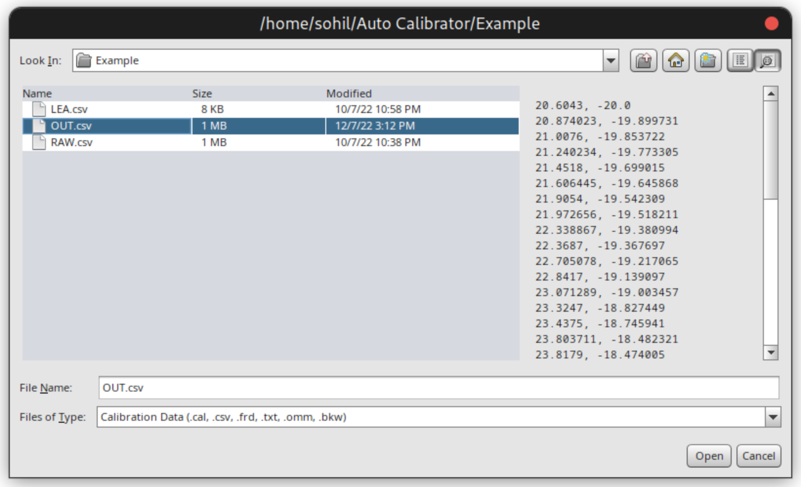

# ITRM-Calibrator
Python Script to calibrate DIY In-ear-monitor(IEM) Test Rig Mics for measurement using the frequency response of known IEMs. 

## About
ITRM-Calibrator is a project aiming to make cheap diy IEM test rigs usable by automatically generating a calibration file. This is done using IEMs for which FR graphs are already available. 
These FR graphs can be obtained using squigs of various IEM reviewers(Ex. Crinacle, Precogvision, Super* Review etc). This project is entirely written in python and requires the use of sys and os libraries. 
The accuracy of the output is mostly limited by unit variation between the Reviewer's Unit and Your Personal Unit. 
My tests using Tripowin Lea, HZsound Heart Mirror and Tin T2 Plus provided fairly accurate results. 
Effects of Modding are particularly accurate using this as it is a relative measurement. 

## Hardware Required
-Any Microphone(I harvested mine from an inline microphone) 
-A tube like object to hold the IEM from one side and microphone stuck to the other. 
-TRS to TRS cable 
-TRRS to TRS Headphone and TRS MIC adapter 
-Soldering Iron 
-An IEM for which FR are already available from a reputed source. 
 
## My Jank Setup

My 'rig' is just a 5.3cm plastic tube with 1cm internal Dia and 1.25cm external Dia. There is a microphone attached at one using epoxy and electric tape all over the tube.

The internal dia is a bit small so only 'S' tip fits but it fits well

I am using a VE Avani for output while using the internal soundcard on my laptop for mic input. You can also have a single sound card do both using a TRRS to TRS Heaphone + TRS Mic adapter.

## Usage

First you need to get the FR graph as .csv for an IEM you have. 

You can get this using screeshot feature of squiglink from any reviewer 
I am going to use Precog's measurements in this case. 

Now we will load this screenshot on [WebPlotDigitizer](https://apps.automeris.io/wpd/)
You can do this using the 'load images' option in the file menu at top left. 

Set the X1,X2 and Y1,Y2 values to calibrate axes. Use arrow keys to do so with more accuracy. Here I am using X1=20;X2=15000;Y1=30;Y2=80

Set the color that has to be graphed using the color picker to the right.

Now use the pen to select the graph region.

Delete any points that lie outside the graph using delete option.

Click on the view data button to get the compiled data then click on 'Download .CSV'. 
I have saved the file as LEA.csv in this case.

Now Close WebPlotDigitizer and now launch REW. 
Make sure all the devices are connected before launching REW.

Now go to REW and make sure the output and input devices are setup properly. You can also change the mic volume here.

Now click on 'Measure' on top left. On the dialog box click on 'Check Level'. Make sure it is around or above 80db. Increase the output volume if required but avoid increasing input volume above 50%. Also make sure any Sound enhancements are off. Windows usually has enhancements on by default on both input and output also check realtek control panel settings if you have it. On linux disable any user installed audio effects (no default audio effects here usually) and make sure you have used 'Capture' for input in the REW Prefrences.

Click on start to start measurement, do not change any settings for now. Also make sure there is no other application playing any sort of audio. The environment should also be sufficiently silent, to achieve this you can tuck in the 'rig' in a ball of blanket or something. When the mesurement is complete. Go to 'All SPL' tab and click on 'controls' on top right. Apply 1/12 smoothing. Click on Export as txt.

Follow the settings on this image and click ok. Now save it with .csv extension. Here I am going to save it as RAW.csv. 
Once done minimize (do not close) REW. Also do not change the volume settings on your device.
Now copy all the files into a folder with Calibrate.py

Run ./Calibrate.py RAW.csv LEA.csv OUT.csv

You can plug in the names as per requirement.

This will generate a file named OUT.csv.

Now go back to REW. Click on 'Measure' and on the dialog box click on 'Cal Files'

Now go to the OUT.csv file (Click on the file name or icon, REW doesn't register if you click on empty space after file name).  
Click open.  
Then select Start.

Voila! Your 'rig' should now be calibrated to the reference target.  
Now again it's not perfectly accurate but should be a good enough utility to help in your modding adventures.  
Also note down the values of the output volume and mic input volume in case you have to measure some other set.
